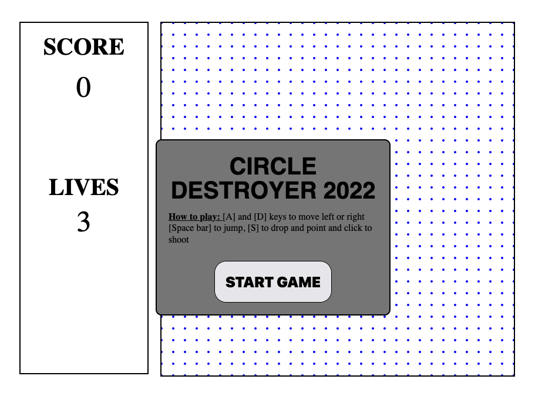
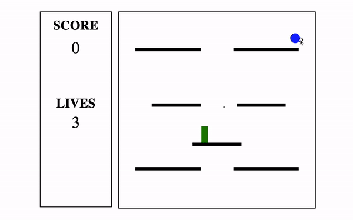
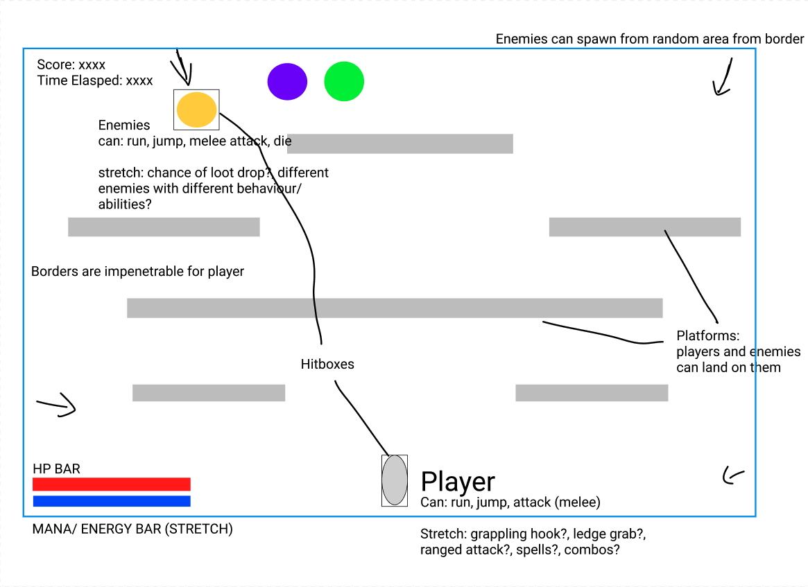

# Circle Destroyer 2022

## Project Overview:

This project was the first project I did during my Software Engineering Immersive course at General Assembly. This project began after my cohort and I had learned about JavaScript, HTML and CSS. 

My project is a game that is hosted on a website where all of the mechanics and visuals are created using JavaScript, HTML and CSS.



## Deployment:

This game has been deployed via GitHub Pages and is available to play here.

## How to download:

To download the game files you can either clone the repository or download them as a ZIP file here.

If you want to clone the repository:
    1. Click the button labeled ‘Code’.
    2. On the dropdown menu select HTTPS and copy the link provided.
    3. Using the terminal, navigate to where you want to clone the repository and execute the command: “git clone (copied HTTPS link)”
If you want to download the ZIP file:
    1. Click the button labeled ‘Code’
    2. Click the ‘Download ZIP’ button on the dropdown menu.

## Goal and TimeFrame:

The objective of this project was to create a fully playable browser game within 7 days.


## Technology used:

- HTML5
- HTML Canvas
- CSS3
- JavaScript
- Git

## Gameplay:



Circle Destroyer 2022 is a game where the player plays as a rectangle and tries to achieve the highest score possible. The rectangle can run and jump around an arena and fire bullets that eliminate enemies.

The player increases their score by eliminating enemies, their score also increases periodically if they stay alive.

## Process

### Planning
The first step for this project was to come up with an idea. My aim was to make a game that I would enjoy playing, and I eventually came up with the idea for a survival-platformer. I created a wire-frame for how I wanted the final game to look.



### Shooting

The first thing that I did was create the shooting mechanics. 

```
    let bulletArray = [bulletOne, bulletTwo, bulletThree, bulletFour, bulletFive, bulletSix, bulletSeven]
        let shotBulletArray = []
        let j = 0
        function whereDoIShoot(event) {
            if (keyArray["click"]["pressed"]) {
                return
            }
            keyArray["click"]["pressed"] = true
            setTimeout(function () {
                keyArray["click"]["pressed"] = false
            }, 300)
            shotBulletArray.push(bulletArray[j])
            const xCoord = event.clientX - canvasRect.x
            const yCoord = event.clientY - canvasRect.y
            const theta = Math.atan2(yCoord - (theHero.y + (theHero.height / 2)), xCoord - (theHero.x + (theHero.width / 2)))
            let opposite = Math.cos(theta)
            let adjacent = Math.sin(theta)
            bulletArray[j].x = theHero.x + (theHero.width / 2)
            bulletArray[j].y = theHero.y + (theHero.height / 2)
            bulletArray[j].dx = opposite * 10
            bulletArray[j].dy = adjacent * 10
            j++
            if (j === 6) {
                j = 0
            }
        }       
```

- I created a ‘Projectile’ class that houses the size, position, and speed of the bullets.
- An object that holds key value pairs of key names and booleans tracks whether buttons have been pressed or released.
    - I set a maximum shooting speed by only allowing the player to shoot in 300ms intervals.
- ‘bulletArray’ is an array that holds all the instances of the ‘Projectile’ class.
    - When the player fires a bullet, the corresponding Projectile in ‘bulletArray’ is pushed to the ‘shotBulletArray’.
        - The game animates all the bullets in the ‘shotBulletArray’ so they are seen flying across the screen.
- The game takes the coordinate of where the player clicked and calculates the x and y velocities so the bullet will hit said coordinate.
    - The bullet is also set to originate from the player’s position.  

### Movement
Next, I created the player's movement mechanics.

```
    class Entity {
        constructor(x, y, height, width, color, dx, dy) {
            this.x = x
            this.y = y
            this.height = height
            this.width = width
            this.color = color
            this.dx = dx
            this.dy = dy
            this.centerX = this.x + this.width / 2
            this.centerY = this.y + this.height / 2
        }
        //this method draws the entity
        drawRect() {
            context.fillStyle = this.color
            context.fillRect(this.x, this.y, this.width, this.height)
        }
        //this method checks to see which key is pressed and moves the player character accordingly
        whereTo(event) {
            switch (event.key) {
                case "a":
                    keyArray["a"]["pressed"] = true
                    if (theHero.dx <= -5) {
                        break
                    }
                    theHero.dx -= 6
                    break
                case "d":
                    keyArray["d"]["pressed"] = true
                    if (theHero.dx >= 5) {
                        break
                    }
                    theHero.dx += 6
                    break
                case " ":
                case "w":
                    // when the space-bar is pressed, if the player has not jumped twice yet and they're not holding the button down, theHero will jump
                    if (keyArray[" "]["n"] >= 2) {
                        break
                    }
                    keyArray[" "]["pressed"] = true
                    if (!event.repeat) {
                        theHero.dy -= 30
                    }
                    break
                // let's the player
                case "s":
                    keyArray[" "]["n"] = 2
                    keyArray["s"]["pressed"] = true
            }
        }
```

- The rectangle that the player controls is an instance of the ‘Entity’ class.
    - The method ‘WhereTo’ of the Entity class changes the velocity of the rectangle according to which button is pressed.

```
    stop(event) {
            switch (event.key) {
                case "a":
                    keyArray["a"]["pressed"] = false
                    theHero.dx += 6
                    break
                case "d":
                    keyArray["d"]["pressed"] = false
                    theHero.dx -= 6
                    break
                case " ":
                case "w":
                    //the number of jump checker is incremented when the space-bar is released
                    keyArray[" "]["n"]++
                    break
                case "s":
                    keyArray["s"]["pressed"] = false
                    break
            }
        }
```

- The ‘stop’ method checks to see when the player stops pressing the key and resets the rectangle’s movement. 

```
    playerGravity() {
            let closestPlatform = this.isOnPlatform()
            doWeStop = closestPlatform && this.dy > 0
            if (doWeStop && standingOn === floor) {
                keyArray[" "]["pressed"] = false
                keyArray[" "]["n"] = 0
                this.dy -= this.dy
                this.y = closestPlatform.y - this.height
            } else if (doWeStop && keyArray["s"]["pressed"] === false) {
                keyArray[" "]["pressed"] = false
                keyArray[" "]["n"] = 0
                this.dy -= this.dy
                this.y = closestPlatform.y - this.height
            } else {
                if (this.dy >= 6) {
                    return
                } else {
                    this.dy += 3
                }
            }
        }
```

```
      isOnPlatform() {
            let feet = this.height + this.y
            let rightSide = this.x + this.width
            let xPos = this.x
            return platformArray.find(function (platform) {
                const checkX = (xPos >= platform.x && rightSide <= platform.x + platform.width)
                const checkY = (feet >= platform.y && feet <= platform.y + 30)
                if (checkX && checkY) {
                    standingOn = platform
                }
                return checkX && checkY
            })
        }
```

- In order for the player to be able to jump, I had to create a gravity mechanic.
- Gravity constantly pulls the player downwards at a set velocity.
- The ‘isOnPlatform’ method checks all the platforms in the game and finds the one closest to the player. 
    - If the player is standing on that platform then gravity will stop pulling them down.

### Enemies

The enemies in this game needed to be able to follow the player wherever they went and avoid obstacles.

```
    pathfinder = function (start, goal) {
            let frontier = new Queue()
            frontier.put(start)
            frontier.put(start)
            let reached = {}
            while (!frontier.empty()) {
                let current = frontier.get()
                if (arraysEqual(current, goal)) {
                    break
                }
                let neighborArrayLength = gameGraph.neighbors(current).length
                for (let i = 0; i < neighborArrayLength; i++) {
                    let next = gameGraph.neighbors(current)[i]
                    if (!reached[next]) {
                        frontier.put(next)
                        reached[next] = current
                    }
                }
            }
            return reached
        }
```
    - In order for the enemies to find a path to the player, I needed to create a graph of nodes on top of the game canvas.
    - ‘pathfinder’ is a method on the ‘Enemy’ class that creates a path of nodes from the enemy to the player using the Breadth First Search algorithm.
        - This method links all the nodes on the path together.

```
    makeThePath(start, goal) {
                let reached = this.pathfinder(start, goal)
                let pathArray = [goal]
                let startNode = start
                let currentNode = reached[goal]
                while (!arraysEqual(currentNode, startNode)) {
                    pathArray.push(currentNode)
                    currentNode = reached[currentNode]
                }
                this.path = pathArray
                this.i = pathArray.length - 1
                return pathArray
            }
```
- ‘makeThePath’ is a method of the ‘Enemy’ class that turns the aforementioned path into an array of node coordinates that the enemy will follow to reach the player.

```
     movementLoop() {
            let moveTime = setTimeout(() => {
                if (this.path.length < 1) {
                    return
                }
                let dx = this.path[this.i][0] - this.x
                let dy = this.path[this.i][1] - this.y
                let velocities = velocityHypot(dx, dy)
                this.dx = Math.ceil(velocities[0] * this.velocity)
                this.dy = Math.ceil(velocities[1] * this.velocity)
                this.i--
                if (this.i > 0) {
                    this.movementLoop()
                } else {
                    this.path = []
                    this.dx = 0
                    this.dy = 0
                    clearTimeout(moveTime)
                    this.isChasing = false
                    return
                }
            }, 400)
        }
```

- The next method of the ‘Enemy’ class is ‘movementLoop’.
    - This method uses the function ‘velocityHypot’  to give the enemy an x and y velocity based on its position relative to the player. 
    - It repeats this continuously as the enemy iterates through the path of nodes.
    - If the enemy has not reached the end of the path it calls itself to repeat the process. Otherwise, it stops chasing the player.
    - The ‘movementLoop’ is set to be a 400ms timeout so the enemy only changes direction every 400ms. 
        - Without the 400ms delay the game would lag.

```
    touchedHero() {
            let xDifference = (theHero.x + theHero.width / 2) - this.x
            let yDifference = theHero.y - this.y
            let hDistance = Math.hypot(yDifference, xDifference)
            if (hDistance <= this.radius * 1.7 && !heroDamaged) {
                heroLives--
                livesRemaining.innerHTML = `${heroLives}`
                heroDamaged = true
                theHero.color = "lightgreen"
                setTimeout(() => {
                    heroDamaged = false
                    theHero.color = "green"
                }, 500)
            }
        }
```

- To register when the enemies successfully hit the player, I used the ‘touchedHero’ method.
    - This function calculates the length of the hypotenuse of the triangle created by the difference in x and y between the enemy and the player. If the distance is less than the radius of the enemy it registers a hit by reducing the player’s health.

## Bugs
The major known bugs are as follows:
    1. Collision detection between enemies and the player is inconsistent. Sometimes it only registers if the center of the enemy touches the player.
    2. Enemies become ‘confused’ for a moment if they are at the corner of a platform.
    3. When enemies get close to the player they slow down significantly.    

## Wins
### Enemy AI
The biggest thing that I’m proud of was the enemy AI. I had no idea how to create a pathfinding algorithm before the project and it took me a full day to research the topic. 
I then had to create the algorithm and implement it into the game. The implementation of the algorithm to the enemy AI was the most difficult challenge during this project.The logic behind making the enemies use the algorithm and follow it was very complicated. Managing to overcome these challenges and have the AI working was something I am very proud of.

### Overall Gameplay

Apart from the Enemy AI, the other aspects of the game (movement, platforming and shooting) all work quite smoothly and the player experience is quite smooth. Each of these mechanics were their own challenge and the fact that they all work together smoothly is a great achievement for me. 

In addition, I believe that the gameplay of this game is quite enjoyable. The game is not perfect but the core gameplay is fun to play and ultimately that was my number one goal for this project.

## Challenges

The biggest challenges I faced while making this project were:
    1. Breadth First Search pathfinding algorithm (learning and implementing it in a short time frame).
    2. Enemy movement (logic involved with having the enemies follow the path to the player).


## Takeaways

This project helped me to solidify my ability to use HTML, CSS and JavaScript to create a webpage. It also pushed me to be creative and intelligent about overcoming the problems I faced. My key takeaways are:
    - Learning how to make a pathfinding algorithm.
    - A lot of experience in debugging and problem solving.
    - Experience in using HTML5 Canvas.
    - Great increase in JavaScript skill.
        - Using object-oriented programming to make the code more efficient.

## Future Improvements
    Features I would add if I were to improve the game include:
        - Different weapons/power ups that can be picked up.
        - An inventory so the player can choose which weapons to use.
        - Different kinds of enemies.

